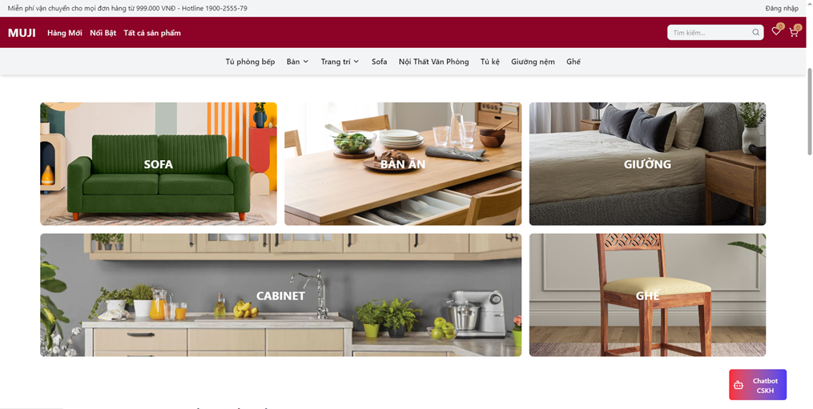
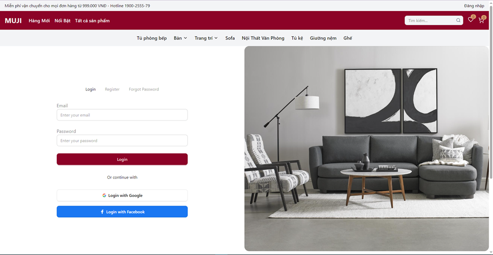
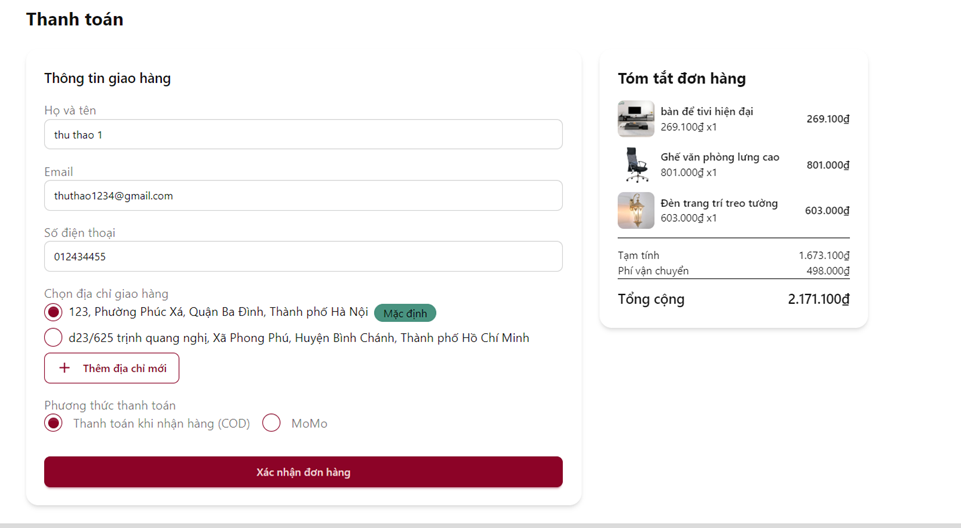
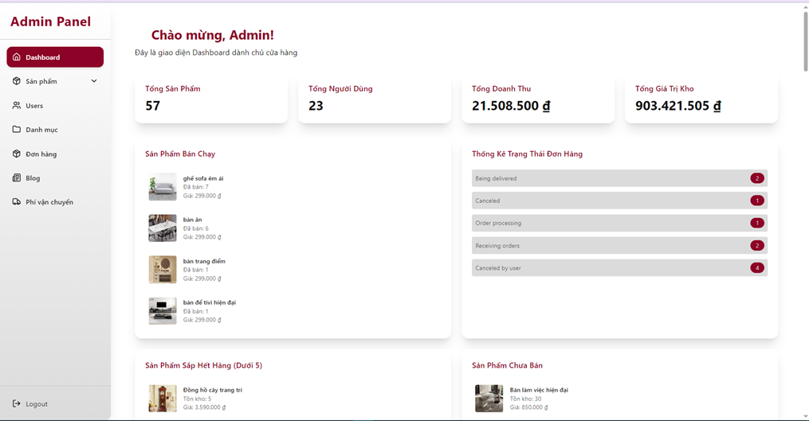
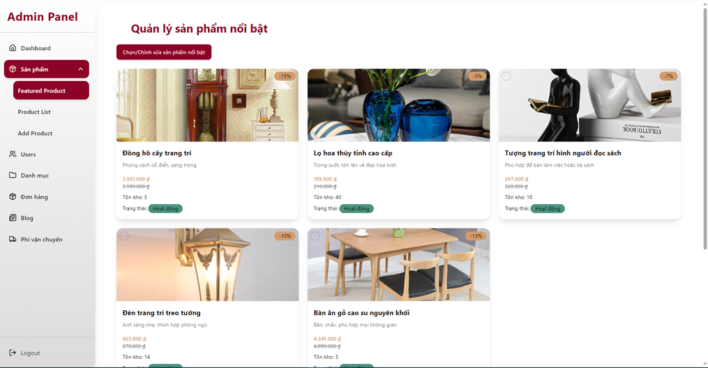
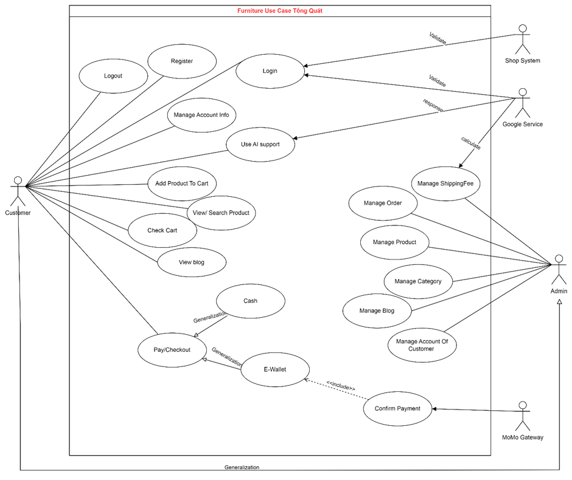
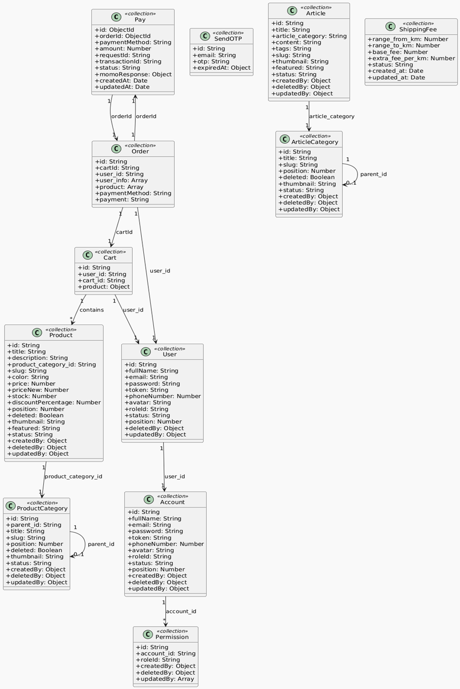
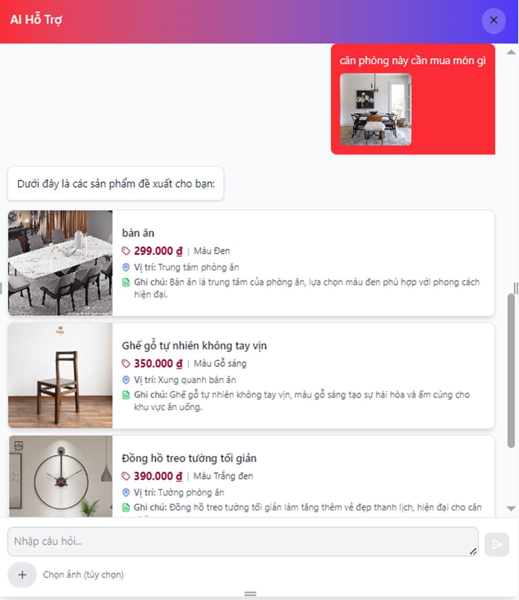

# FurnitureStore - E-Commerce Platform

_Software Engineering course project, Semester 2, Year 3 at PTIT._

**FurnitureStore** is a modern e-commerce platform that allows users to browse, search, and purchase furniture items online conveniently and efficiently. The system is designed for both end-users (customers) and administrators, with full functionality for managing shopping carts, orders, and business reports.

---

🎥 **Project Demo Video**  
DEMO nhanh chức năng chính của dự án **Furniture E-commerce Website**

Watch the demo: https://youtu.be/t2IEb6jVnkU

📄 **Project Documents**

- Report: https://drive.google.com/file/d/17F_bGY3mna2lEAw-XsPv65aAfCwnvvyW/view?usp=sharing
- Slide: https://drive.google.com/file/d/12Zki4MTilQNdUkp7HURph7e7laReAM30/view?usp=sharing

---

## Table of Contents

1. [Introduction](#introduction)
2. [Integrated APIs](#integrated-apis)
3. [Features](#features)
4. [Project Screenshots](#project-screenshots)
5. [Frontend](#frontend)
6. [Backend](#backend)
7. [Installation](#installation)
8. [Usage](#usage)
9. [Contributing](#contributing)
10. [License](#license)

---

## Introduction

**FurnitureStore** is a Software Engineering project developed by PTIT students. It aims to build a complete online furniture shopping platform, capable of:

- Managing products, orders, shipping, and customer information.
- Supporting both online payment and cash on delivery (COD).
- Integrating AI chatbot for customer support.

---

## Integrated APIs

| API        | Purpose                                                                      | Related Feature                    |
| ---------- | ---------------------------------------------------------------------------- | ---------------------------------- |
| Gemini API | Powers the AI chatbot for customer Q&A and personalized product suggestions. | AI chatbot support                 |
| Map API    | Calculates `shipping cost fee` based on delivery distance.                   | Checkout, shipping fee calculation |
| MoMo API   | Enables online payment via MoMo e-wallet.                                    | Payment/Checkout                   |

---

## Features

- **Flexible Payment:** Supports MoMo and COD.
- **Smart Cart System:** Add, update, delete products and save wishlist items.
- **Advanced Search:** Filter by price, color, material, and category.
- **Order Management:** Track order status, cancel orders, receive notifications.
- **Admin Dashboard:** Manage products, accounts, orders, and reports.
- **Map-Based Shipping Fee:** Automatically calculate delivery fee using Map API based on distance.
- **AI Support (Gemini):** Chatbot for assistance and product suggestions.

---

## Project Screenshots

### Demo Clusters

| Cluster       | Screenshots                                                                                                                                                                                                                  |
| ------------- | ---------------------------------------------------------------------------------------------------------------------------------------------------------------------------------------------------------------------------- |
| Customer Flow |  <br/>  <br/>  |
| Admin Flow    |  <br/>                                      |
| System Design |  <br/>                                        |

### AI Chatbot Demo



---

## Frontend

### Technologies Used

- React.js – UI development.
- Tailwind CSS – Responsive design.
- React Router – Page routing.

### Frontend Setup

```bash
# Navigate to frontend directory
cd fe

# Install dependencies
npm install

# Run development server
npm start
```

---

## Backend

### Technologies Used

- Node.js + Express – Build RESTful API.
- MongoDB – NoSQL database.
- JWT – Secure authentication.
- Mongoose – ORM for MongoDB.
- Map API – Calculate shipping fees by distance.
- MoMo SDK – Payment integration.

### Backend Setup

```bash
# Navigate to backend directory
cd be

# Create a .env file with the following content:
# DB_URI=mongodb://localhost:27017/furniturestore
# JWT_SECRET=your_jwt_secret
# MOMO_PARTNER_CODE=xxx
# MOMO_ACCESS_KEY=xxx
# MOMO_SECRET_KEY=xxx
# BASE_URL=http://localhost:3000

# Install dependencies
npm install

# Run development server
npm run dev
```

---

## Usage

1. Visit the customer interface at `http://localhost:3000`
2. Register an account, browse products, add to cart
3. Proceed to checkout and track your orders
4. Access the admin interface at `http://localhost:3000/admin` for management (admin login required)

---

## Contributing

Contributions are welcome! Feel free to open a Pull Request or create an issue to discuss new features or improvements.

---

## License

This project is owned by students of class E22CQCN02-N, Posts and Telecommunications Institute of Technology (PTIT), and is for academic purposes only.
